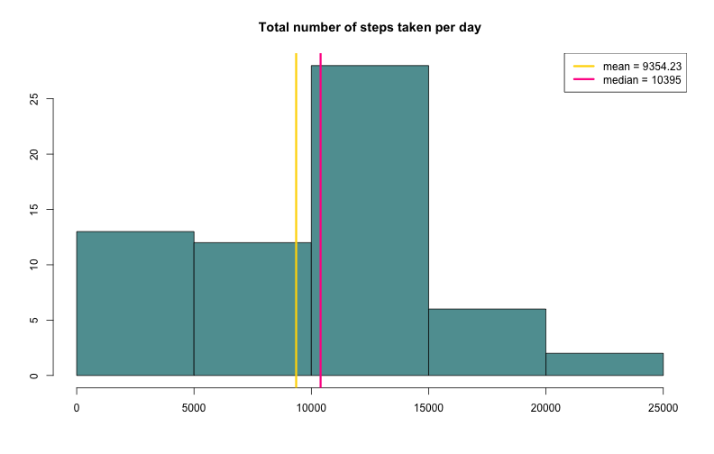
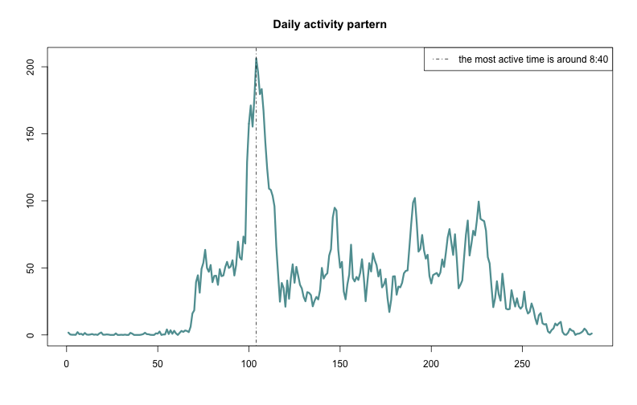
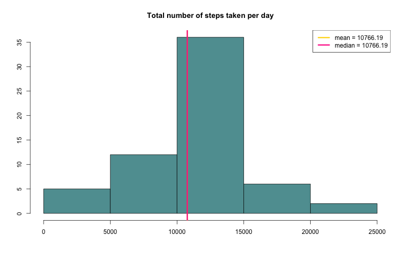
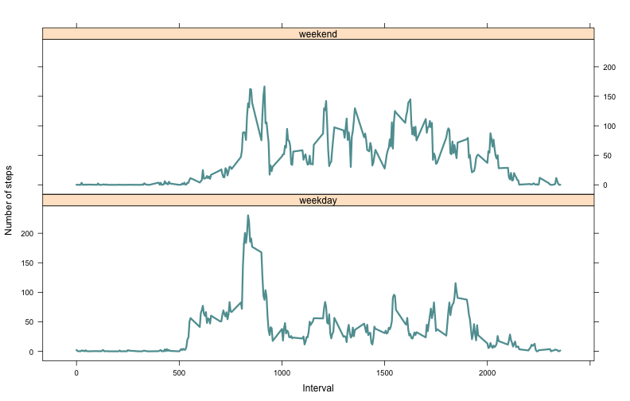

# Reproducible Research: Peer Assessment 1


```r
opts_chunk$set(echo = FALSE)
```


## Loading and preprocessing the data

```
## 'data.frame':	17568 obs. of  3 variables:
##  $ steps   : int  NA NA NA NA NA NA NA NA NA NA ...
##  $ date    : chr  "2012-10-01" "2012-10-01" "2012-10-01" "2012-10-01" ...
##  $ interval: int  0 5 10 15 20 25 30 35 40 45 ...
```

```
##      steps           date              interval   
##  Min.   :  0.0   Length:17568       Min.   :   0  
##  1st Qu.:  0.0   Class :character   1st Qu.: 589  
##  Median :  0.0   Mode  :character   Median :1178  
##  Mean   : 37.4                      Mean   :1178  
##  3rd Qu.: 12.0                      3rd Qu.:1766  
##  Max.   :806.0                      Max.   :2355  
##  NA's   :2304
```


## What is mean total number of steps taken per day?
 

### The mean and median of original data:  
### - mean = 9354.23
### - median = 1.0395 &times; 10<sup>4</sup>
## What is the average daily activity pattern?
 

### The most "active" 5-minute interval is 104, that corresponds to 8:40.  
### What about yours most active time of the day?
  
## Imputing missing values
 

### There was 2304 missing values in original data set.
### Missing data was replaced by the mean of corresponding 5-minute interval.
### And as we see, filling missing data makes median and mean equal.


## Are there differences in activity patterns between weekdays and weekends?
 

### The patterns look similar, but on weekends less early morning activity and "rush hour" pick.
###  So, weekends are more healthy!
